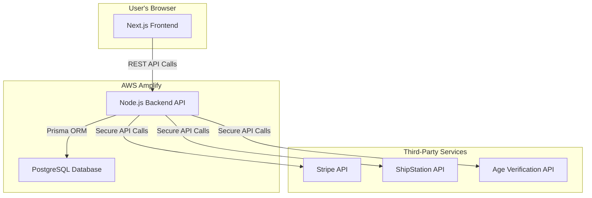

Of course. Here is the comprehensive Architecture Overview document for the lastgenie project, written in a professional and detailed manner.

---

```markdown
# Architecture Overview: lastgenie

| | |
| :--- | :--- |
| **Document Type** | Architecture Overview |
| **Project** | lastgenie |
| **Category** | architecture |
| **Version** | 1.0 |
| **Date** | 2023-10-27 |
| **Author** | Technical Writer AI |

---

## 1.0 Introduction

### 1.1 Purpose

This document provides a high-level architectural overview for the **lastgenie** ecommerce platform. Its primary purpose is to define the system's structure and illustrate how the core application will integrate with essential third-party services. This guide will serve as a foundational blueprint for the development team, ensuring a cohesive, scalable, and secure system.

### 1.2 System Context

The **lastgenie** project is a direct-to-consumer ecommerce website for a sexual enhancer drink. The platform is built on a modern technology stack (Next.js, Node.js) and aims to provide a seamless user experience while handling sensitive transactions and adhering to legal compliance for age-restricted products.

This document focuses specifically on the integration architecture for three critical external services:
*   **Stripe:** For payment processing and subscription management.
*   **ShipStation:** For order fulfillment and shipping logistics.
*   **Age Verification API:** For ensuring legal compliance.

---

## 2.0 Core System Architecture

The platform utilizes a decoupled, client-server architecture to ensure flexibility, performance, and scalability.

*   **Frontend (Client):** A Next.js application responsible for rendering the user interface and managing client-side state. It will be a static-first site with server-side rendering (SSR) for dynamic content, providing excellent performance and SEO. The frontend communicates with the backend via a RESTful API.
*   **Backend (Server):** A Node.js application using the Express framework. It serves as the central API, handling business logic, database interactions, and secure communication with third-party services.
*   **Database:** PostgreSQL managed via the Prisma ORM. Prisma provides type-safety and simplifies database queries, migrations, and data modeling.
*   **Deployment:** The entire application will be deployed and managed using AWS Amplify, which provides a robust, scalable, and integrated environment for modern web applications.

### High-Level Diagram



---

## 3.0 Third-Party Service Integrations

The backend will act as a secure proxy and orchestrator for all third-party communications, ensuring that API keys and sensitive logic are never exposed to the client.

### 3.1 Payment Processing: Stripe

Stripe is selected for its robust API, comprehensive documentation, security (PCI compliance), and built-in support for subscription models, which is critical for the "Subscribe and Save" feature.

**Integration Strategy:** We will use **Stripe Checkout**, a prebuilt, hosted payment page. This strategy offloads the majority of PCI compliance responsibility to Stripe, reduces frontend complexity, and provides a highly optimized, mobile-friendly checkout experience.

**Workflow:**
1.  **Initiate Checkout:** A user clicks "Checkout" on the frontend.
2.  **Create Session:** The Next.js client sends a request to our backend API (`/api/v1/checkout/create-session`) with the cart items.
3.  **Backend to Stripe:** The Node.js backend validates the request and uses the Stripe Node.js library to create a Checkout Session. This session includes line items, prices, tax rates, and specifies `mode: 'payment'` for one-time purchases or `mode: 'subscription'` for the "Subscribe and Save" 12-packs.
4.  **Redirect to Stripe:** The backend returns the Stripe Session ID to the client. The client uses the Stripe.js library to redirect the user to the secure Stripe Checkout page.
5.  **Payment & Confirmation:** The user completes payment on the Stripe page. Stripe then redirects the user back to a success or failure page on our site (e.g., `/order/success`).
6.  **Webhook Fulfillment:** Stripe sends a `checkout.session.completed` webhook event to a dedicated endpoint on our backend (`/api/v1/webhooks/stripe`). This is the definitive signal of a successful payment. The webhook handler will then create the order in our PostgreSQL database and trigger the fulfillment process with ShipStation.

**Backend Code Example (Creating a Stripe Checkout Session):**
```javascript
// file: backend/src/controllers/checkoutController.js

const stripe = require('stripe')(process.env.STRIPE_SECRET_KEY);

exports.createCheckoutSession = async (req, res) => {
  const { line_items, mode } = req.body; // line_items sent from client

  // Basic validation
  if (!line_items || !mode) {
    return res.status(400).json({ error: 'Missing required session parameters.' });
  }

  try {
    const session = await stripe.checkout.sessions.create({
      payment_method_types: ['card'],
      line_items, // e.g., [{ price: 'price_1Lxxxx...', quantity: 1 }]
      mode, // 'payment' or 'subscription'
      success_url: `${process.env.CLIENT_URL}/order/success?session_id={CHECKOUT_SESSION_ID}`,
      cancel_url: `${process.env.CLIENT_URL}/cart`,
      // We can collect shipping details if not already collected
      shipping_address_collection: {
        allowed_countries: ['US', 'CA'],
      },
    });

    res.status(200).json({ id: session.id });
  } catch (error) {
    console.error('Stripe session creation failed:', error);
    res.status(500).json({ error: 'Could not create checkout session.' });
  }
};
```

### 3.2 Shipping & Fulfillment: ShipStation

ShipStation will serve as the central hub for managing orders, calculating shipping rates, printing labels, and tracking shipments.

**Integration Strategy:** All interactions with ShipStation will be handled by the backend server via the ShipStation API. This ensures order data is processed securely and reliably.

**Workflow:**
1.  **Order Creation:** After a successful payment is confirmed by the Stripe webhook, the backend service gathers all necessary order information (customer name, shipping address from Stripe, product SKUs, quantities).
2.  **Send to ShipStation:** The backend makes a `POST` request to the ShipStation `/orders/createorder` endpoint, transmitting the order data.
3.  **Fulfillment:** The fulfillment team views and processes the new order within the ShipStation dashboard. They select a carrier, purchase postage, and print the shipping label.
4.  **Tracking Update (Webhook):** When a label is created and the order is shipped, ShipStation sends a `SHIP_NOTIFY` webhook to a dedicated endpoint on our backend (`/api/v1/webhooks/shipstation`).
5.  **Update Customer:** The backend webhook handler parses the tracking information, updates the corresponding order status in our database, and can trigger an email notification (via a service like Klaviyo) to the customer with their tracking number.

**Conceptual Data Flow (Backend Service):**
```javascript
// pseudo-code: backend/src/services/shipstationService.js

// Called after Stripe 'checkout.session.completed' event
async function createShipStationOrder(orderData) {
  const shipstationPayload = {
    orderNumber: orderData.internalOrderId, // Our DB order ID
    orderDate: new Date().toISOString(),
    orderStatus: 'awaiting_shipment',
    customerUsername: orderData.customerEmail,
    billTo: { ... },
    shipTo: {
      name: orderData.shipping.name,
      street1: orderData.shipping.address.line1,
      city: orderData.shipping.address.city,
      state: orderData.shipping.address.state,
      postalCode: orderData.shipping.address.postal_code,
      country: orderData.shipping.address.country,
    },
    items: [
      // map our products to ShipStation line items
      {
        sku: 'GENIE-M-50',
        name: 'Genie Male Enhancer (50ML)',
        quantity: 1,
        unitPrice: 10.00,
      }
    ],
  };

  // Make authenticated API call to ShipStation
  await shipstationApi.post('/orders/createorder', shipstationPayload);
}
```

### 3.3 Age Verification

To ensure compliance with regulations surrounding sexual wellness products, a robust third-party age verification API is required. The choice of provider (e.g., Veratad, AgeChecker.Net) can be finalized later, as the architectural pattern remains consistent.

**Integration Strategy:** The backend will serve as a secure proxy for the age verification API call. This prevents exposure of the API key on the frontend and allows for server-side logging and control over the verification process. Verification will be implemented as a mandatory step during the checkout flow, before payment is initiated.

**Workflow:**
1.  **Trigger Verification:** On the checkout page, before the "Pay" button is enabled, the user is prompted to verify their age. A form will collect the necessary PII (e.g., Full Name, DOB, Address).
2.  **Client to Backend:** The frontend sends the user-submitted PII to a secure endpoint on our backend (`/api/v1/verify-age`).
3.  **Backend to Verification API:** The backend server receives the data, adds the secret API key, and makes a `POST` request to the third-party verification service.
4.  **Receive Response:** The verification service returns a response, typically including a `status` (e.g., `pass`, `fail`, `manual_review`) and a transaction ID.
5.  **Backend to Client:** Our backend processes this response and sends a simplified, non-sensitive result back to the client (e.g., `{ verified: true }`). It should **never** return the raw PII or detailed failure reasons to the client.
6.  **Unlock Checkout:** If `verified: true`, the frontend state updates to allow the user to proceed with payment via Stripe. If false, an appropriate message is displayed.

**Backend Code Example (Proxy Endpoint):**
```javascript
// file: backend/src/controllers/verificationController.js

const axios = require('axios');

exports.verifyUserAge = async (req, res) => {
  const { firstName, lastName, dob, address } = req.body;

  // Validate incoming data
  if (!firstName || !lastName || !dob) {
    return res.status(400).json({ verified: false, message: 'Missing required verification fields.' });
  }

  const VERIFICATION_API_URL = 'https://api.ageverifyservice.com/v1/verify';
  const API_KEY = process.env.AGE_VERIFICATION_API_KEY;

  try {
    const response = await axios.post(VERIFICATION_API_URL, {
        firstName,
        lastName,
        dateOfBirth: dob,
        // ...other required fields
      }, {
        headers: { 'Authorization': `Bearer ${API_KEY}` }
      }
    );

    // Process the specific response structure of the chosen provider
    if (response.data.status === 'pass') {
      // Optional: Log the verification transaction ID in our DB
      res.status(200).json({ verified: true });
    } else {
      res.status(403).json({ verified: false, message: 'Age verification failed.' });
    }
  } catch (error) {
    console.error('Age verification service error:', error);
    res.status(500).json({ verified: false, message: 'An error occurred during verification.' });
  }
};
```

---

## 4.0 Security & Compliance

*   **PCI Compliance:** Handled primarily by Stripe Checkout, drastically reducing the scope of our compliance requirements. No sensitive cardholder data will ever touch our servers.
*   **PII Protection:** All communication between the client and backend must be over HTTPS. API keys and secrets for third-party services will be stored as environment variables on the AWS Amplify backend and never exposed client-side.
*   **Age Verification:** The integration of a robust age verification API is a critical step in mitigating legal risk and ensuring compliance with federal and state regulations for marketing and selling age-restricted products.

---

## 5.0 Document Control

| Version | Date | Author | Changes |
| :--- | :--- | :--- | :--- |
| 1.0 | 2023-10-27 | Technical Writer AI | Initial draft of the architecture overview. |
```