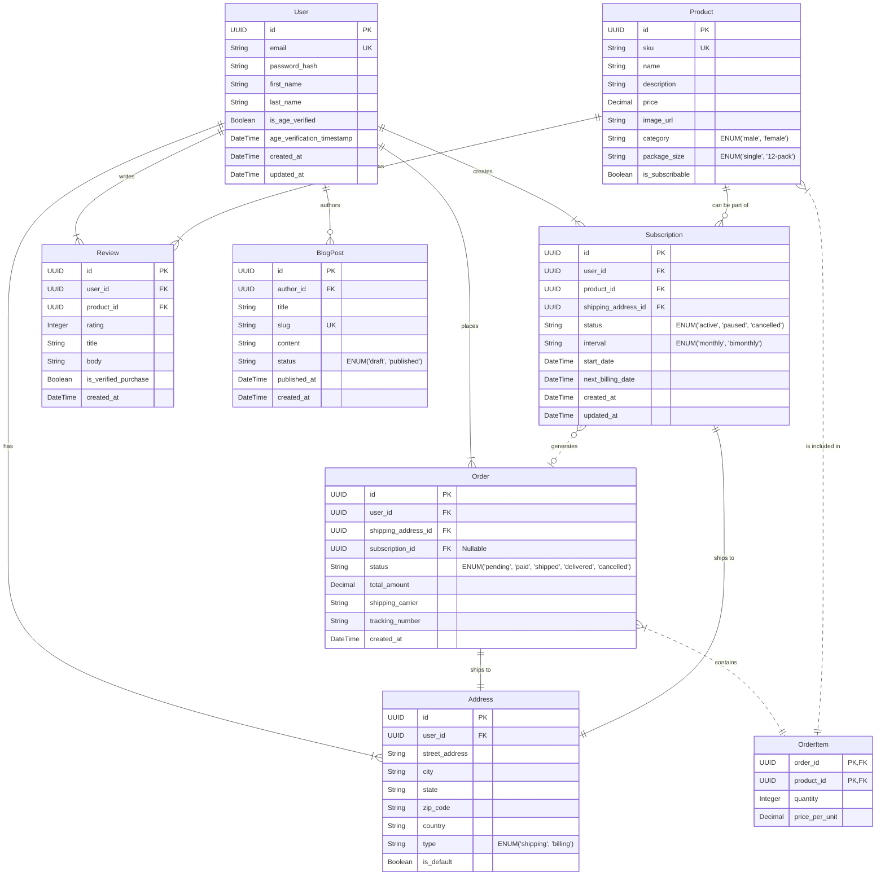

# Entity Relationship Diagram (ERD)

**Category:** Architecture
**Purpose:** This document visualizes the core database schema and data relationships for the lastgenie ecommerce website. It provides a blueprint for developers, focusing on the interactions between users, products, orders, and the critical 'subscribe and save' feature.

---

## 1. Overview

The Entity Relationship Diagram (ERD) is a foundational architectural document that defines the structure of the application's data layer. For the lastgenie project, a well-defined database schema is essential for managing customer information, processing transactions, and implementing the recurring revenue model through subscriptions.

This diagram outlines the primary entities (tables), their attributes (columns), and the relationships between them. It has been designed with scalability and data integrity in mind, using a PostgreSQL database and the Prisma ORM as specified in the project's technical stack. The following diagram and definitions will serve as the single source of truth for the database structure.

## 2. ER Diagram

The following diagram is rendered using Mermaid syntax. It illustrates the relationships between the core entities of the lastgenie platform.



## 3. Relationship Explanations

*   **User & Address (One-to-Many):** A single `User` can have multiple `Address` records (e.g., for shipping and billing). Each `Address` belongs to exactly one `User`.
*   **User & Order (One-to-Many):** A `User` can place many `Orders`. Each `Order` is associated with one `User`.
*   **User & Subscription (One-to-Many):** A `User` can have multiple `Subscriptions` (e.g., one for the male 12-pack and one for the female 12-pack). Each `Subscription` belongs to one `User`.
*   **User & Review (One-to-Many):** A `User` can write many `Reviews` for products they have purchased. Each `Review` is authored by one `User`.
*   **User & BlogPost (One-to-Many):** A `User` (with appropriate permissions) can author multiple `BlogPosts`.
*   **Order & OrderItem (One-to-Many):** An `Order` is composed of one or more `OrderItems`. This is a composite relationship where `OrderItem` acts as a join table.
*   **Product & OrderItem (One-to-Many):** A `Product` can be included in many `OrderItems` across different orders.
*   **Subscription & Product (Many-to-One):** A `Subscription` is for a single, specific `Product` (one of the 12-packs). A `Product` can be part of many different subscriptions.
*   **Subscription & Order (One-to-Many, Optional):** A `Subscription` generates `Orders` on a recurring basis. The `subscription_id` on the `Order` table is a foreign key that links an order back to the subscription that created it. This field is nullable because single-purchase orders are not generated by a subscription.
*   **Order/Subscription & Address (Many-to-One):** An `Order` and a `Subscription` are each associated with one specific `Address` for shipping purposes.

## 4. Entity Definitions

Below are the detailed definitions for each table, including column names, data types (PostgreSQL), and descriptions.

### 4.1. `User`
Stores customer account information and age verification status.

| Column | Type | Constraints | Description |
| :--- | :--- | :--- | :--- |
| `id` | `UUID` | Primary Key | Unique identifier for the user. |
| `email` | `VARCHAR(255)` | Not Null, Unique | User's email address, used for login and communication. |
| `password_hash` | `VARCHAR(255)` | Not Null | Hashed password for secure authentication. |
| `first_name` | `VARCHAR(100)` | Nullable | User's first name. |
| `last_name` | `VARCHAR(100)` | Nullable | User's last name. |
| `is_age_verified` | `BOOLEAN` | Not Null, Default `false` | Flag indicating if the user has passed age verification. |
| `age_verification_timestamp` | `TIMESTAMPTZ` | Nullable | Timestamp of when age verification was successfully completed. |
| `created_at` | `TIMESTAMPTZ` | Not Null | Timestamp of when the user account was created. |
| `updated_at` | `TIMESTAMPTZ` | Not Null | Timestamp of the last update to the user's record. |

### 4.2. `Address`
Stores shipping and billing addresses associated with a user.

| Column | Type | Constraints | Description |
| :--- | :--- | :--- | :--- |
| `id` | `UUID` | Primary Key | Unique identifier for the address. |
| `user_id` | `UUID` | Not Null, Foreign Key (`User.id`) | Links the address to a user. |
| `street_address` | `VARCHAR(255)` | Not Null | Street name and number. |
| `city` | `VARCHAR(100)` | Not Null | City name. |
| `state` | `VARCHAR(100)` | Not Null | State, province, or region. |
| `zip_code` | `VARCHAR(20)` | Not Null | Postal or ZIP code. |
| `country` | `VARCHAR(50)` | Not Null | Country name or code (e.g., 'USA'). |
| `type` | `ENUM` | Not Null | Type of address: `shipping` or `billing`. |
| `is_default` | `BOOLEAN` | Not Null, Default `false` | Indicates if this is the user's default address for its type. |

### 4.3. `Product`
Stores details for each sellable item (SKU).

| Column | Type | Constraints | Description |
| :--- | :--- | :--- | :--- |
| `id` | `UUID` | Primary Key | Unique identifier for the product/SKU. |
| `sku` | `VARCHAR(100)` | Not Null, Unique | Stock Keeping Unit (e.g., 'GEN-M-50ML'). |
| `name` | `VARCHAR(255)` | Not Null | Public-facing product name (e.g., "Genie for Him - 50mL"). |
| `description` | `TEXT` | Not Null | Detailed product description. |
| `price` | `DECIMAL(10, 2)`| Not Null | Price of the product in USD. |
| `image_url` | `VARCHAR(255)` | Nullable | URL for the primary product image. |
| `category` | `ENUM` | Not Null | Product category: `male` or `female`. |
| `package_size` | `ENUM` | Not Null | Package size: `single` (50ml) or `12-pack`. |
| `is_subscribable`| `BOOLEAN` | Not Null, Default `false`| `true` if this product is available for subscription. |

### 4.4. `Subscription`
Manages the core 'subscribe and save' logic.

| Column | Type | Constraints | Description |
| :--- | :--- | :--- | :--- |
| `id` | `UUID` | Primary Key | Unique identifier for the subscription. |
| `user_id` | `UUID` | Not Null, Foreign Key (`User.id`) | The user who owns this subscription. |
| `product_id` | `UUID` | Not Null, Foreign Key (`Product.id`) | The product being subscribed to (must be `is_subscribable`). |
| `shipping_address_id` | `UUID` | Not Null, Foreign Key (`Address.id`) | The address where recurring orders will be shipped. |
| `status` | `ENUM` | Not Null | `active`, `paused`, or `cancelled`. |
| `interval` | `ENUM` | Not Null | Frequency of billing/shipping (e.g., `monthly`). |
| `start_date` | `DATE` | Not Null | The date the subscription was initiated. |
| `next_billing_date` | `DATE` | Not Null | The date of the next scheduled charge and order creation. |
| `created_at` | `TIMESTAMPTZ` | Not Null | Timestamp of when the subscription was created. |
| `updated_at` | `TIMESTAMPTZ` | Not Null | Timestamp of the last update to the subscription. |

### 4.5. `Order`
Represents a single transaction, whether a one-time purchase or a recurring subscription order.

| Column | Type | Constraints | Description |
| :--- | :--- | :--- | :--- |
| `id` | `UUID` | Primary Key | Unique identifier for the order. |
| `user_id` | `UUID` | Not Null, Foreign Key (`User.id`) | The user who placed the order. |
| `shipping_address_id` | `UUID` | Not Null, Foreign Key (`Address.id`) | The address the order was shipped to. |
| `subscription_id` | `UUID` | Nullable, Foreign Key (`Subscription.id`) | Links the order to the subscription that generated it. |
| `status` | `ENUM` | Not Null | `pending`, `paid`, `shipped`, `delivered`, `cancelled`. |
| `total_amount` | `DECIMAL(10, 2)`| Not Null | Final amount charged, including shipping and taxes. |
| `shipping_carrier`| `VARCHAR(50)` | Nullable | The carrier used for shipping (e.g., 'USPS', 'FedEx'). |
| `tracking_number` | `VARCHAR(255)` | Nullable | Tracking number provided by the carrier. |
| `created_at` | `TIMESTAMPTZ` | Not Null | Timestamp of when the order was placed. |

### 4.6. `OrderItem`
A join table linking products and quantities to a specific order.

| Column | Type | Constraints | Description |
| :--- | :--- | :--- | :--- |
| `order_id` | `UUID` | Primary Key, Foreign Key (`Order.id`) | The order this item belongs to. |
| `product_id` | `UUID` | Primary Key, Foreign Key (`Product.id`) | The product included in the order. |
| `quantity` | `INTEGER` | Not Null | The number of units of this product in the order. |
| `price_per_unit` | `DECIMAL(10, 2)`| Not Null | The price of the product at the time of purchase. |

---

## 5. Prisma Schema Implementation Example

This section provides a partial `schema.prisma` file that translates the core ERD entities into a format usable by the Prisma ORM. This serves as a direct, actionable starting point for backend development.

```prisma
// This is an example `schema.prisma` file.

generator client {
  provider = "prisma-client-js"
}

datasource db {
  provider = "postgresql"
  url      = env("DATABASE_URL")
}

model User {
  id                         String      @id @default(cuid())
  email                      String      @unique
  password_hash              String
  first_name                 String?
  last_name                  String?
  is_age_verified            Boolean     @default(false)
  age_verification_timestamp DateTime?
  created_at                 DateTime    @default(now())
  updated_at                 DateTime    @updatedAt

  addresses     Address[]
  orders        Order[]
  subscriptions Subscription[]
  reviews       Review[]
  blogPosts     BlogPost[]
}

model Address {
  id             String        @id @default(cuid())
  user           User          @relation(fields: [user_id], references: [id])
  user_id        String
  street_address String
  city           String
  state          String
  zip_code       String
  country        String
  type           AddressType
  is_default     Boolean       @default(false)
  
  orders        Order[]
  subscriptions Subscription[]
}

model Product {
  id              String         @id @default(cuid())
  sku             String         @unique
  name            String
  description     String
  price           Decimal
  image_url       String?
  category        ProductCategory
  package_size    PackageSize
  is_subscribable Boolean        @default(false)

  orderItems      OrderItem[]
  subscriptions   Subscription[]
  reviews         Review[]
}

model Subscription {
  id                  String           @id @default(cuid())
  user                User             @relation(fields: [user_id], references: [id])
  user_id             String
  product             Product          @relation(fields: [product_id], references: [id])
  product_id          String
  shipping_address    Address          @relation(fields: [shipping_address_id], references: [id])
  shipping_address_id String
  status              SubscriptionStatus
  interval            SubscriptionInterval
  start_date          DateTime
  next_billing_date   DateTime
  created_at          DateTime         @default(now())
  updated_at          DateTime         @updatedAt

  generated_orders    Order[]
}

model Order {
  id                  String       @id @default(cuid())
  user                User         @relation(fields: [user_id], references: [id])
  user_id             String
  shipping_address    Address      @relation(fields: [shipping_address_id], references: [id])
  shipping_address_id String
  subscription        Subscription? @relation(fields: [subscription_id], references: [id])
  subscription_id     String?
  status              OrderStatus
  total_amount        Decimal
  shipping_carrier    String?
  tracking_number     String?
  created_at          DateTime     @default(now())
  
  items               OrderItem[]
}

model OrderItem {
  order          Order   @relation(fields: [order_id], references: [id])
  order_id       String
  product        Product @relation(fields: [product_id], references: [id])
  product_id     String
  quantity       Int
  price_per_unit Decimal

  @@id([order_id, product_id])
}

model Review {
  id                    String   @id @default(cuid())
  user                  User     @relation(fields: [user_id], references: [id])
  user_id               String
  product               Product  @relation(fields: [product_id], references: [id])
  product_id            String
  rating                Int
  title                 String
  body                  String
  is_verified_purchase  Boolean  @default(false)
  created_at            DateTime @default(now())
}

// ENUM definitions for clarity and type safety
enum AddressType {
  shipping
  billing
}

enum ProductCategory {
  male
  female
}

enum PackageSize {
  single
  twelve_pack // "12-pack" is not a valid enum member name
}

enum SubscriptionStatus {
  active
  paused
  cancelled
}

enum SubscriptionInterval {
  monthly
  bimonthly
}

enum OrderStatus {
  pending
  paid
  shipped
  delivered
  cancelled
}

```